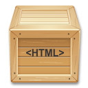

# Westwind.HtmlPackager



HtmlPackager is a tiny standalone Windows Exe or .NET component that allows you to package content from a URL as a self-contained, local HTML file that can be saved and viewed offline.

The packager can create:

* **A single, large self-contained HTML File**
* **An HTML file with external, local assets**
* **A Zip package of the latter file and folder assets**

This library is provided as a small **.NET 4.5 executable** and **.NET Library** and distributed via:

* [Chocolatey](https://chocolatey.org/packages/HtmlPackager) 
* [NuGet](https://www.nuget.org/packages/Westwind.HtmlPackager) 

The packager works with:

* Web Urls
* Local HTML Files

There are two packaging modes:

* **Package to a single file**  
All related resources are downloaded and embedded into the HTML content. CSS is embedded as text while images, scripts and url resources are embedded as base64 data links. The result is one very large HTML document that contains all resources embedded.

* **HTML file plus loose Resource Files**  
Produces an HTML file plus all CSS, Script, images, fonts as loose files stored in the same folder as the HTML.

The .NET EXE is a single file EXE that requires .NET 4.5+.

The .NET library allows embedding of the packaging functionality into your own applicaitons. It is very small and self-contained and can be easily added to another project with two source files, or you can use [NuGet](https://www.nuget.org/packages/Westwind.HtmlPackager) to include the binaries. The library has an external dependency on [HtmlAgilityPack](http://html-agility-pack.net) for HTML parsing.

Supported .NET Targets:

* .NET 4.5+
* .NET Standard 2.0

## Standalone HtmlPackager Application (Windows)
The HTML Packager is available as a self contained Windows Console application in HtmlPackager.exe which [you can download and copy as needed](https://github.com/RickStrahl/Westwind.HtmlPackager/blob/master/HtmlPackager.exe). You can also use the [Chocolatey](https://chocolatey.org/packages/HtmlPackager) package:

```
choco install HtmlPackager
```

The packager runs as a single file EXE (packaged with ILMerge) with a few command line options.

```txt
Syntax:
-------
HtmlPackager <sourceUrl> -o <outputFile> [-x|-z] -d

Commands:
---------
HELP || /?          This help display           

Options:
--------
sourceUrl           Source Url or local file to an HTML document
-o <outputFile>     Output HTML file or Zip file (-z)
                    (if output file is not provided output is sent to StdOut)                                       
-x                  Create external dependencies in folder of HTML document
-z                  Create zip file with all dependencies included in zip
-d                  Display generated HTML page or Zip file
```

### Examples
The following are a few examples you can try to capture output.

Create a single self-contained HTML document from a URL and display in your browser:

```
HtmlPackager  https://markdownmonster.west-wind.com  -o c:\temp\github_home.html -d
```

Create an HTML file from a URL with all dependencies stored as loose files in the output file's folder (`-x`) and display in your browser (`-d`):

```
HtmlPackager  https://weblog.west-wind.com -o c:\temp\west-wind.html -x -d
```

Create a self-contained HTML file from a local HTML file:

```
HtmlPackager  %userprofile%\Documents\myapp\somePage.html -o %TEMP%\app_saved.html
```

Package to a Zip file:

```
HtmlPackager  https://github.com -o c:\temp\github-home.zip -z -d
```

## .NET Library and C# Source Code
The packager is also avalailable as a NuGet package you can add to your project.

### Installation via NuGet
You can install this library from [NuGet](https://www.nuget.org/packages/Westwind.HtmlPackager):

```
install-package Westwind.HtmlPackager
```

or 

```
dotnet add package Westwind.HtmlPackager
```

## Usage
The following are various usage examples for packaging HTML from files or Web URLs into the two package formats.

### Capture HTML File to embedded HTML as String
The following captures the HTML to a single file string from a local file on disk:

```cs
var inputFile = Path.Combine(Path.GetTempPath(), "_MarkdownMonster_Preview.html");
var packager = new HtmlPackager();
string packaged = packager.PackageHtml(inputFile);

string outputFile = InputFile.Replace(".html", "_PACKAGED.html");

File.WriteAllText(outputFile, packaged);

Console.WriteLine(packaged);
```

### Capture HTML File to embedded HTML as File

```cs
var inputFile = Path.Combine(Path.GetTempPath(), "_MarkdownMonster_Preview.html");
string outputFile = InputFile.Replace(".html", "_PACKAGED.html");

var packager = new HtmlPackager();
string packaged = packager.PackageHtmlToFile(inputFile,outputFile);


// display html in browser
Utils.GoUrl(outputFile);
```

#### Capture Web Url to single File
```cs
var packager = new HtmlPackager();
string packaged = packager.PackageHtml("https://west-wind.com");

string outputFile = InputFile.Replace(".html", "_PACKAGED.html");
File.WriteAllText(outputFile, packaged);

ShellUtils.GoUrl(outputFile);
```

#### Capture File to HTML File + Loose Resources

```cs
var packager = new HtmlPackager();
string outputFile = @"c:\temp\GeneratedHtml\Output.html";
bool result = packager.PackageHtmlToFolder(@"c:\temp\tmpFiles\_MarkdownMonster_Preview.html", outputFile,
    null, true);
Assert.IsTrue(result);

// Display html in browser
Utils.GoUrl(outputFile);
```

#### Capture Web Url to HTML File + Loose Resources

```cs
var packager = new HtmlPackager();
string outputFile = @"c:\temp\GeneratedHtml\Output.html";
bool result = packager.PackageHtmlToFolder("http://west-wind.com/", outputFile, null, true);

ShellUtils.GoUrl(outputFile);
```

## License
The Westwind.HtmlPackager library is license  under the [MIT License](https://opensource.org/licenses/MIT) and there's no charge to use, integrate or modify the code for this project. You are free to use it in personal, commercial, government and any other type of application.

All source code is copyright West Wind Technologies, regardless of changes made to them. Any source code modifications must leave the original copyright code headers intact.

> It's free as in free beer, but if this saved you some time and you're overflowing with gratitude you can buy me a beer:
>
> [Make a Donation with PayPal](https://www.paypal.com/cgi-bin/webscr?cmd=_s-xclick&hosted_button_id=DJJHMXWYPT3E2)

## Warranty Disclaimer: No Warranty!
IN NO EVENT SHALL THE AUTHOR, OR ANY OTHER PARTY WHO MAY MODIFY AND/OR REDISTRIBUTE THIS PROGRAM AND DOCUMENTATION, BE LIABLE FOR ANY COMMERCIAL, SPECIAL, INCIDENTAL, OR CONSEQUENTIAL DAMAGES ARISING OUT OF THE USE OR INABILITY TO USE THE PROGRAM INCLUDING, BUT NOT LIMITED TO, LOSS OF DATA OR DATA BEING RENDERED INACCURATE OR LOSSES SUSTAINED BY YOU OR LOSSES SUSTAINED BY THIRD PARTIES OR A FAILURE OF THE PROGRAM TO OPERATE WITH ANY OTHER PROGRAMS, EVEN IF YOU OR OTHER PARTIES HAVE BEEN ADVISED OF THE POSSIBILITY OF SUCH DAMAGES.